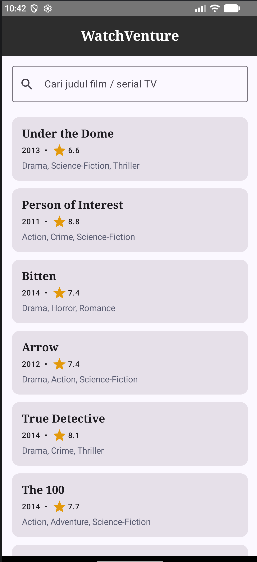
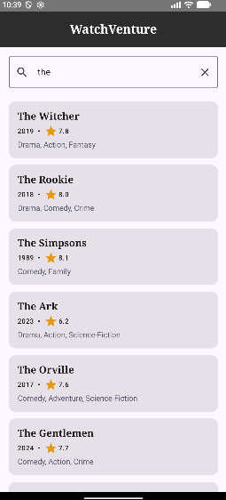
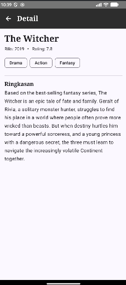

# WatchVenture

Aplikasi mobile Android untuk mencari dan melihat informasi film / serial televisi dari **TVmaze API**.
Dibangun dengan **Kotlin, Jetpack Compose, Material 3, Navigation Compose, dan arsitektur MVVM**.

## Deskripsi Singkat

WatchVenture memiliki dua halaman:

1. **Home Screen** – judul aplikasi, search bar, dan daftar film/serial (`LazyColumn`). Saat query kosong, aplikasi menampilkan daftar default dari API. Saat pengguna mengetik, aplikasi mengambil hasil pencarian dari API (dengan debounce 500 ms).
2. **Detail Screen** – menampilkan judul, tahun rilis, rating, genre, dan ringkasan dari show yang dipilih.

Fitur: pencarian berdasarkan judul, state loading, state error + tombol *Coba lagi*, custom theme (light/dark) dan custom typography.

## Screenshot & GIF

> Ganti bagian ini dengan hasil capture dari emulator/perangkat kamu.

| Home | Pencarian | Detail |
|------|-----------|--------|
|  |  |  |

## Struktur MVVM

```
com.example.watchventure
├── MainActivity.kt                 // entry point, memasang theme + navigation
├── navigation/
│   └── AppNavigation.kt            // NavHost: Home <-> Detail
├── ui/
│   ├── theme/                      // Color.kt, Type.kt, Theme.kt (custom theme & typography)
│   ├── screens/
│   │   ├── HomeScreen.kt           // View (Composable)
│   │   └── DetailScreen.kt         // View (Composable)
│   └── viewmodel/
│       ├── HomeViewModel.kt        // state: query, hasil, loading, error
│       └── DetailViewModel.kt      // state: detail, loading, error
└── data/
    ├── model/Show.kt               // Data class: DTO, model UI, mapper
    ├── remote/TvMazeApi.kt         // Retrofit interface + instance
    └── repository/ShowRepository.kt
```

| Layer | Tanggung jawab |
|-------|----------------|
| **View (Composable)** | Hanya menampilkan UI dari `uiState` dan meneruskan event (ketik, klik) ke ViewModel. Tidak memanggil API. |
| **ViewModel** | Menyimpan state dalam `StateFlow`, menjalankan coroutine (`viewModelScope`), memanggil Repository. |
| **Repository** | Satu-satunya akses data; memanggil Retrofit dan memetakan DTO ke model UI, hasil dibungkus `Result`. |
| **Model** | `ShowDto`, `SearchResultDto` (bentuk JSON), `Show` (model untuk UI). |

Alur data: `Composable → ViewModel → Repository → Retrofit → TVmaze API`, lalu hasilnya mengalir kembali lewat `StateFlow` sehingga UI ter-*recompose*.

### State-driven UI

- `HomeUiState(query, shows, isLoading, error)`
- `DetailUiState(show, isLoading, error)`

Composable mengamati state dengan `collectAsState()`; setiap perubahan state memicu recomposition.

## Penggunaan API

Base URL: `https://api.tvmaze.com/` (dokumentasi: https://www.tvmaze.com/api)

| Endpoint | Kegunaan |
|----------|----------|
| `GET /search/shows?q={judul}` | Pencarian berdasarkan judul (Home) |
| `GET /shows?page=0` | Daftar default saat query kosong (Home) |
| `GET /shows/{id}` | Detail satu show (Detail) |

Data yang dipakai: `name`, `premiered` (diambil 4 digit tahun), `rating.average`, `genres`, `summary` (tag HTML dibersihkan). Gambar tidak ditampilkan sesuai ketentuan.

## Cara Menjalankan

1. Buka folder project di **Android Studio** (Koala atau lebih baru), tunggu Gradle sync.
2. Pastikan perangkat/emulator terhubung ke internet.
3. Jalankan konfigurasi `app` (Run ▶).

## Teknologi

Kotlin · Coroutines · Jetpack Compose · Material 3 · Navigation Compose · ViewModel · Retrofit + Gson
